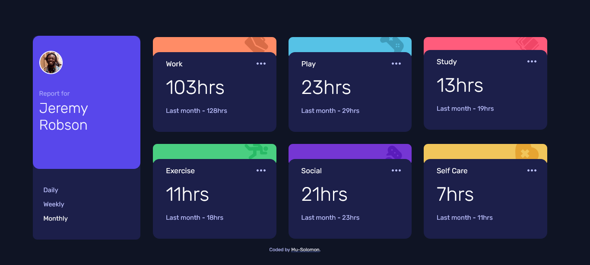

# Frontend Mentor - Time tracking dashboard solution

This is a solution to the [Time tracking dashboard challenge on Frontend Mentor](https://www.frontendmentor.io/challenges/time-tracking-dashboard-UIQ7167Jw). Frontend Mentor challenges help you improve your coding skills by building realistic projects. 

## Table of contents

- [Overview](#overview)
  - [The challenge](#the-challenge)
  - [Screenshot](#screenshot)
  - [Links](#links)
  - [Built with](#built-with)
  - [What I learned](#what-i-learned)
- [Author](#author)

**Note: Delete this note and update the table of contents based on what sections you keep.**

## Overview

### The challenge

Users should be able to:

- View the optimal layout for the site depending on their device's screen size
- See hover states for all interactive elements on the page
- Switch between viewing Daily, Weekly, and Monthly stats

### Screenshot




### Links

- Solution URL: [Solution URL here](https://www.frontendmentor.io/solutions/back-with-the-timetrackingdashboard-cssflexbox-and-some-javascript-V9qo7DVBd)
- Live Site URL: [Live site URL here](https://solomon-time-track.netlify.app/)

### Built with

- Semantic HTML5 markup
- CSS custom properties
- Flexbox


### What I learned

It's been really challenging for me to build it up to an extent that I had to re-take the CSS Flex-box course and developed this trial first [Flex-box trial]()

```css
    #look span:first-child {
        flex:1 1 10%;
        /*background-color: rgb(102, 98, 95);*/
        align-items: center;
        justify-content: center;
        height: 12vh;
    }
```


## Author

- Frontend Mentor - [@Mu-Solomon](https://www.frontendmentor.io/profile/Mu-Solomon)
- Email - [@Mu-Solomon](mailto:musolomoni@gmail.com)
